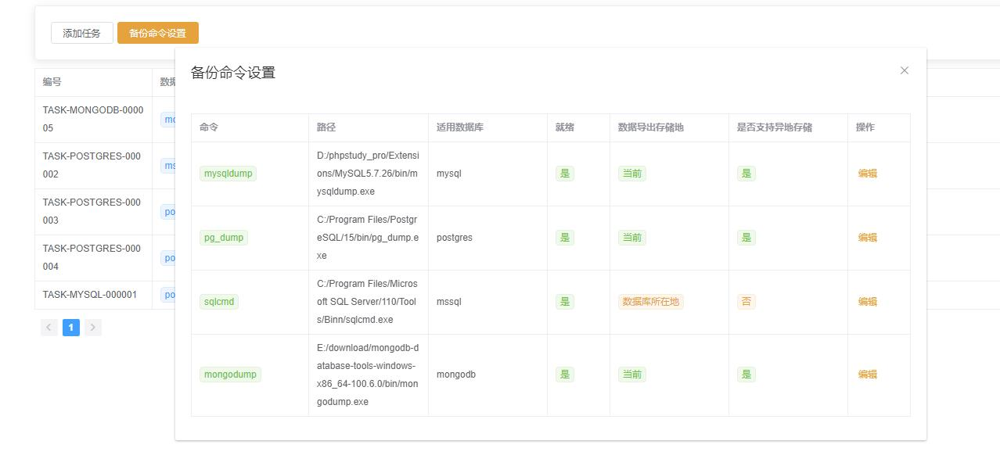

# 柚备数据备份

 **默认浏览器打开端口
    http://ip:8080**
 **默认账号密码：
admin admin** 

#### 介绍
柚备数据备份软件

#### 软件架构

基于beego（现在是gin）框架和xorm做的数据库定时备份系统（现已加入调用本地命令的功能）

前端使用 vue webpack

地址：[gitee.com/countpoison/youbei-element-admin-ui](https://gitee.com/countpoison/youbei-element-admin-ui)

计划任务使用beego的toolbox计划任务

2022-10-26:
加入了调用本地命令备份的功能，需要配置；如下：


加入了mongodb的支持
本次更新变动虽然多，但是兼容老的任务，不修改老任务是完全可以的
由于本次变动较大，新增的功能只做了基础的测试，有什么问题 欢迎反馈

2022-08-08：
后台做了较大调整
1. 取消conf/app.conf
2. 框架由之前的beego改成了gin 支持静态文件打包成一个exe 详情看static/static.go文件
3. 本地sqlite改了默认路径,在以下路径查找
```
if sysos == "windows" {
    DBdir = os.Getenv("APPDATA") + "/youbei"
} else {
    DBdir = "/usr/local/youbei"
}

```

2021-02-19：
UI界面做了较大调整，仓库重新开了一个
beego框架升级为2.0.1
golang升级为1.16
优化大量变量名称和代码结构
修复部分BUG


#### 源码安装教程

1. 安装golang开发环境,配置环境变量
2. 安装源码和工具

##### 1.11和1.12版本
##### 将下面两个设置添加到系统的环境变量中
```
GO111MODULE=on
GOPROXY=https://goproxy.io
```

##### 1.13版本之后
##### go env 环境变量设置
```
go env -w GO111MODULE=on
go env -w GOPROXY=https://goproxy.cn,https://goproxy.io,direct
```

##### 下载源码到当前youbei目录，安装bee工具
```

git clone https://gitee.com/countpoison/youbei youbei

go get github.com/beego/bee （可选）

```

3.  运行
##### 进入目录，运行程序
```

cd youbei

bee run (没有安装bee直接执行go run main.go)

```


#### 功能 2021-02-19

```

1.数据库备份（支持mysql，sql server，sqlite3，pgsql）
    
2.支持自定义 ftp 和 sftp 远程上传

3.计划任务支持快捷选择 和 linux crontab 自定义写法

4.支持Windows和linux系统

5.web管理平台

6.支持跨主机备份（需要数据库服务器开启远程登录）

7.支持文件备份

8.新增了实验性的Yserver上传服务

9.ip白名单登录控制

10.支持本地备份数据按数量保留

11.支持远程备份主机（当前仅支持远程的机器是ssh连接和mysql数据库），可下载到本地，和远程存储关联

12.初始化命令支持

```

使用截图：


如果有有意思的功能需求，可以联系我
